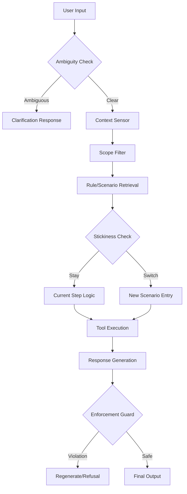

# Gemini Control Proposal

**Status**: Proposal for Consolidation
**Objective**: Maximize alignment and safety while minimizing latency and complexity.
**Philosophy**: **Pragmatic Determinism**.
- **Rules are Flat Constraints**, not a dependency graph.
- **Scenarios are State Containers**, not just loose prompts.
- **Enforcement is Non-Negotiable**, but optimized for speed where possible.

This document serves as the decision matrix for the Focal system architecture, reconciling proposals from Claude and Codex.

---

## 1. Core Decisions & Architecture

### Decision 1: Rule Representation (The "No Graph" Decision)
**Context**: Previous proposals suggested a graph structure for rules (e.g., "Rule A entails Rule B", "Rule C excludes Rule D").
**Decision**: **REJECT Graph Rules. Use Scoped Metadata.**
- **Why**: Graph rules introduce hidden dependencies that are hard to debug ("Why did Rule X fire? Oh, because Rule Y matched implicitly"). They increase latency (graph traversal) and complexity.
- **Gemini Approach**: Rules are a **flat list** filtered by **Scope** (Global, Scenario, Step).
  - If you need "Rule A implies Rule B", simply make Rule B a Global or Scenario rule that matches similar contexts.
  - If you need "Rule A excludes Rule B", handle this via `priority` or explicit conflict resolution logic, not graph edges.
- **Benefit**: Zero-latency lookups, predictable behavior, easy auditing.

### Decision 2: The "Sensor" (Input Processing)
**Context**: Should we separate Context Extraction from Intent Detection?
**Decision**: **Unified "Sensor" Step.**
- **Why**: Running two parallel LLM calls (one for extraction, one for intent) doubles cost/latency for high-correlation tasks.
- **Gemini Approach**: A single, robust `ContextExtractor` call that outputs:
  1.  `detected_intent`: Where the user wants to go.
  2.  `entities`: Variables extracted for the profile/session.
  3.  `ambiguity_score`: (Crucial for safety) A signal to stop and ask clarification *before* taking action.
- **Benefit**: Halves the LLM calls in the critical path.

### Decision 3: Scenario Navigation (Drift Prevention)
**Context**: How to prevent the agent from "ping-ponging" between scenarios (e.g., jumping to "Sales" when a user mentions "price" during a "Refund").
**Decision**: **High-Friction Stickiness.**
- **Why**: Users rarely change topics radically in one turn. The system should bias heavily towards the *current* scenario.
- **Gemini Approach**:
  - **Stickiness Score**: Add a static boost (e.g., +0.25 similarity) to rules/intents within the current Scenario/Step.
  - **Exit Threshold**: Requires a high confidence (>0.85) to *leave* the current scenario.
- **Benefit**: Drastically reduces "hallucinated switching" and keeps the conversation focused.

### Decision 4: Enforcement (The Safety Net)
**Context**: How to ensure the agent never breaks the rules?
**Decision**: **Hybrid "Lane" Enforcement with Pre-Computation.**
- **Why**: Pure LLM judgment is slow; Pure Regex is too weak.
- **Gemini Approach**:
  - **Lane 1 (Deterministic)**: Regex & Code expressions (e.g., `refund_amount <= 50`). Runs instantly. *Always active.*
  - **Lane 2 (Subjective)**: LLM-as-Judge (e.g., "Be polite"). Runs only on risky actions or random sampling for audit.
  - **Global Guardrails**: "Always Enforce" Global Hard Constraints (e.g., "No Competitor Mentions"). These are checked on *every* turn, regardless of context.
- **Benefit**: 100% safety on critical metrics (money, PII) with minimal latency overhead for standard chit-chat.

---

## 2. The Gemini Pipeline (Optimized Flow)

This pipeline is designed to be **linear** (predictable) and **fail-fast** (safe).

### Step-by-Step Logic

1.  **Ambiguity Trap (Fail-Fast)**:
    *   *Before* heavyweight processing, check if the input is too vague.
    *   *Action*: If `ambiguity_score > threshold`, return a "Clarification Request" template immediately.
    *   *Value*: Prevents hallucinating an intent that doesn't exist. Saves cost.

2.  **Context Sensor (The Hydrator)**:
    *   Execute `ContextExtractor`.
    *   Hydrate `CustomerProfile` (long-term) and `Session` (short-term) variables.
    *   *Decision*: Do **not** run a loop here. Single pass. If variables are missing, the *Scenario* logic handles the follow-up question.

3.  **Retriever (The Scope Filter)**:
    *   **Input**: `condition_text` of rules + current `scope` (Global + Current Scenario + Current Step).
    *   **Logic**:
        *   Fetch Global Rules.
        *   Fetch Rules for Current Scenario (if active).
        *   Fetch Rules for Current Step (if active).
    *   **NO** graph expansion. What you see in the scope is what you get.

4.  **Router (Stickiness Logic)**:
    *   Compare `detected_intent` against:
        1.  Current Step Transitions (Priority 1).
        2.  Current Scenario Global Transitions (Priority 2).
        3.  Global Scenario Entry Points (Priority 3 - *Penalized*).
    *   *Decision*: If the user is in a flow, only switch if the Global Intent is overwhelmingly strong.

5.  **Execution & Generation**:
    *   Run tools defined by matched rules.
    *   Generate response using a prompt that strictly includes:
        *   `action_text` from Matched Rules.
        *   Output from Tools.
        *   Relevant Profile fields.

6.  **Enforcement (The Final Gate)**:
    *   **Lane 1**: Extract variables (e.g., `$50`) from response. Check against `enforcement_expression`. Failures trigger immediate fallback.
    *   **Lane 2**: If the rule is marked `subjective` (e.g., "tonality"), run a lightweight LLM check.
    *   **Crucial**: If a **Global Hard Constraint** exists (e.g., "No financial advice"), it is checked here *even if it wasn't retrieved in Step 3*.

---

## 3. Reconciliation Matrix

| Feature | Claude Proposal | Codex Proposal | **Gemini Decision** | Reasoning |
| :--- | :--- | :--- | :--- | :--- |
| **Rule Structure** | Graph (Depends/Entails) | Graph-Augmented | **Flat Scoped List** | Graphs add complexity/latency. Scoping handles 95% of use cases cleanly. |
| **Input Processing** | Combined | Split (Intent + Context) | **Combined (Sensor)** | Single LLM call reduces latency/cost. Data is highly correlated. |
| **Tool Execution** | Iterative Loop | Single Pass | **Single Pass** | Iterative loops risk infinite cycles and unpredictable latency. |
| **Enforcement** | Post-Gen Check | Lanes (Deterministic/LLM) | **Lanes + Global Force** | Adopting Codex's "Lanes" but mandating "Global Force" for safety criticals. |
| **Navigation** | Ambiguity Trap | Stickiness | **Both** | "Ambiguity Trap" prevents bad starts. "Stickiness" prevents bad drifts. |

---

## 4. Implementation Checklist

To build this system:

- [ ] **Refactor Rules**: Ensure `Rule` model has `scope`, `priority`, and `enforcement_expression`. Remove any `graph_links` or `dependencies` fields.
- [ ] **Build Sensor**: Create a `ContextExtractor` prompt that outputs `intent`, `variables`, and `ambiguity_reason` in one JSON.
- [ ] **Implement Scope Retriever**: specific logic to query `Scope.GLOBAL` + `Scope.SCENARIO(id)` + `Scope.STEP(id)`.
- [ ] **Enforcer Service**: Implement `simpleeval` for Lane 1 and `LLM-as-Judge` for Lane 2.
- [ ] **Stickiness Logic**: Modify the `ScenarioFilter` to apply a score penalty to "New Scenario" candidates when a session is active.

This architecture prioritizes the **User's Requirement**: "No mistakes, instant response, zero cost." While "zero cost" is impossible, removing graph traversals and extra LLM calls brings us closest to the ideal.
